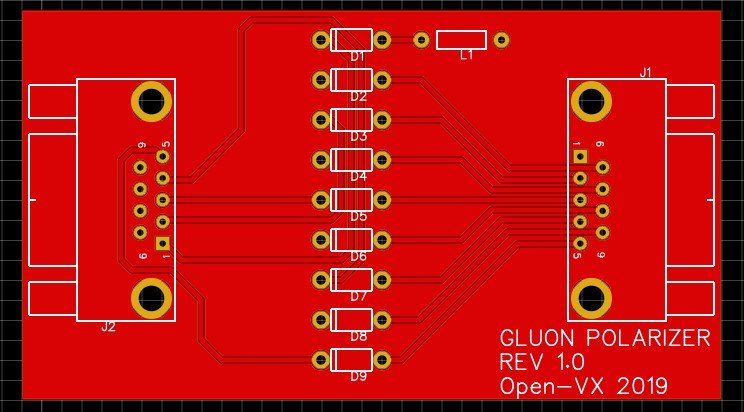
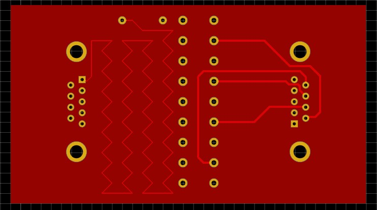

# Gluon-Polarizer
Open source gluon polarizer design for &lt;$10

## Board previews:
Top:

Bottom:

## Assembly:
You can get this assembled from a manufacturer by uploading the files in the `Gerbers` folder. Or, you can [etch the boards yourself](https://www.youtube.com/watch?v=YJgX9Na4rWw) using the `etch_top.pdf` and `etch_bottom.pdf` files. You'll still have to drill all the holes, but that's half the fun!

For the DB9 connectors I'm using the Assman [AE10921](https://www.digikey.com/product-detail/en/assmann-wsw-components/A-DF-09-A-KG-T2S/AE10921-ND/1241800) and [AE10968](https://www.digikey.com/product-detail/en/assmann-wsw-components/A-DS-09-A-KG-T2S/AE10968-ND/1241804), but any through-hole right angle DB9's you have laying around should work. I've had good gluon reception using [1N4007RLG](https://www.digikey.com/product-detail/en/on-semiconductor/1N4007RLG/1N4007RLGOSTR-ND/918021) for D1-D9, YMMV. L1 should be between 1mH - 10mH but it really depends on your rig! 
